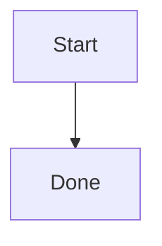

# Rich Markdown Fixture

This fixture covers rich markdown rendering.

## Code

```js
const answer = 42;
```

## Table

| Name | Value |
| --- | --- |
| alpha | 1 |

## Link and Quote

> Quoted text for rendering.

[Example](https://example.com)

## Mermaid



## Raw HTML

<script>window.__docPiMarkdownXss = 1</script>

