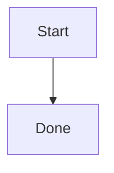

# Rich Markdown Fixture

This fixture covers rich markdown rendering with a footnote.[^1]

[^1]: Footnote content for rendering.

## Code

```js
const answer = 42;
```

## Task List

- [x] Finished item
- [ ] Pending item

## Table

| Name | Value |
| --- | --- |
| alpha | 1 |

## Link and Quote

> Quoted text for rendering.

[Example](https://example.com)
[Local chapter](/sample-chapter.md)
[Hash link](#table)

## Image


## Mermaid



## Invalid Mermaid

```mermaid
this is not valid mermaid
```

## Raw HTML

<svg class="inline-diagram" viewBox="0 0 120 80" width="120" height="80" role="img" aria-label="Inline SVG diagram">
  <title>Inline SVG diagram</title>
  <defs>
    <marker id="raw-html-arrow" viewBox="0 0 10 10" refX="9" refY="5" markerWidth="8" markerHeight="8" orient="auto-start-reverse">
      <path d="M 0 0 L 10 5 L 0 10 z" fill="#24292f" />
    </marker>
    <style>
      @import url("javascript:window.__docPiMarkdownCssImportXss = 1");
      .svg-node { fill: #0969da; stroke: #24292f; stroke-width: 2; }
      .svg-edge { stroke: #24292f; stroke-width: 4; marker-end: url(#raw-html-arrow); }
      .svg-bad { background-image: url(javascript:window.__docPiMarkdownCssUrlXss = 1); width: expression(window.__docPiMarkdownCssExpressionXss = 1); }
    </style>
  </defs>
  <circle class="svg-node" cx="40" cy="40" r="24"></circle>
  <path class="svg-edge" d="M70 40 L105 40"></path>
  <text x="40" y="45" text-anchor="middle" fill="white">A</text>
</svg>

<details class="raw-html-details"><summary>Raw HTML summary</summary><p>Raw HTML body</p></details>

<script>window.__docPiMarkdownXss = 1</script>

<svg onload="window.__docPiMarkdownSvgXss = 1"><a xlink:href="javascript:window.__docPiMarkdownSvgLinkXss = 1"><circle cx="5" cy="5" r="5"></circle></a><foreignObject><body onload="window.__docPiMarkdownForeignObjectXss = 1"></body></foreignObject></svg>
